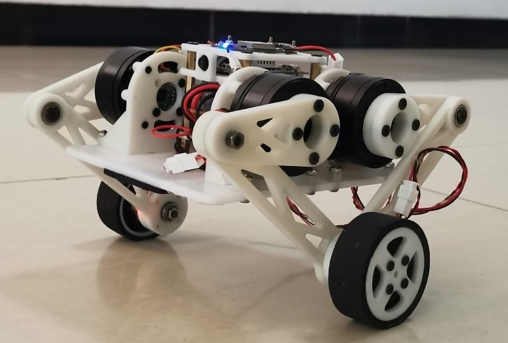
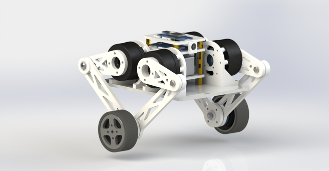
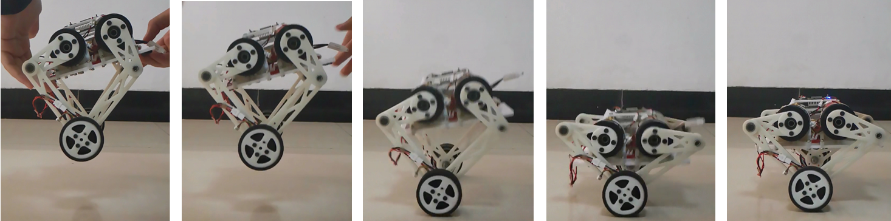

	
	<h1>FOC 双轮腿机器人项目</h1>
	

		
		
		
		
		
		
	

	

		<b>简体中文 | <a href="README_en.md">English</b></a>
	

这是一个完整的机器人项目，包含算法仿真、机械结构设计、电子硬件设计、嵌入式软件设计、上位机软件设计等多个部分，完成了以下内容：

- 使用 SolidWorks 完成的机械结构设计
- 基于 MATLAB / Simulink / Simscape 的算法设计和机器人物理仿真
- 基于 STM32，使用 CAN 通信的无刷电机驱动板
- 基于 ESP32、MPU6050 的运动控制模块（主控模块）
- 基于 ffmpeg / ffserver 的 Linux 图传模块，使用低耦合可拔插方案
- 支持蓝牙配网的 Android 遥控 APP

**演示&介绍视频：**[https://www.bilibili.com/video/BV1bP411k75b/](https://www.bilibili.com/video/BV1bP411k75b/)

---

## 部分效果展示

**机械结构渲染图：**

**Simscape Multibody 仿真效果：**

**机器人加速过程：**

**跌落缓冲效果：**

**遥控APP界面：**

---

## 文件结构

整个机器人项目被分成如下的几个部分，分别位于仓库不同目录下，内部有更详细的说明，读者可以按需查看：

- [`solidworks`](solidworks)：机械结构设计，包含所有零件和总装配体模型文件
- [`matlab`](matlab)：算法仿真，包含模型建立、算法设计和仿真文件等
- [`stm32-foc`](stm32-foc)：无刷电机驱动板，包含硬件设计文件和STM32代码工程
- [`esp32-controller`](esp32-controller)：运动控制模块，包含硬件设计文件和ESP32代码工程
- [`linux-fpv`](linux-fpv)：Linux 图传模块，包含相关Shell脚本和Python脚本
- [`android`](android)：Android 遥控 APP，包含源代码和已编译好的安装包

> 注：图传模块为可选模块，增加可玩性的同时也会明显增加项目的成本和复杂度，删去后其他功能仍可以正常使用

---

## 物料成本

| 项目 | 数量 | 单价 | 总价 |
| :--: | :--: | :--: | :--: |
| 4010电机 | 4 | ￥50.00 | ￥200.00 |
| 2804电机 | 2 | ￥13.00 | ￥26.00 |
| 驱动板元件 | 6 | ￥25.00 | ￥150.00 |
| 主控板元件 | 1 | ￥20.00 | ￥20.00 |
| 航模锂电 | 1 | ￥28.00 | ￥28.00 |
| 3D打印件 | - | 约￥100.00 | 约￥100.00 |
| 定制亚克力 | 1 | ￥5.00 | ￥5.00 |
| 轴承、螺丝 | - | 约￥20.00 | 约￥20.00 |
| 图传核心板（可选） | 1 | ￥150.00 | ￥150.00 |
| 摄像头（可选） | 1 | ￥20.00 | ￥20.00 |
| **总计（不含图传）** | - | - | **￥549.00** |
| **总计（含图传）** | - | - | **￥719.00** |

> 注：以上为笔者实际购买价格，仅供参考，部分购买链接请在各模块的说明中查看
