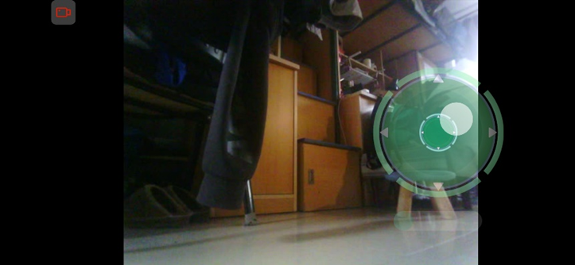
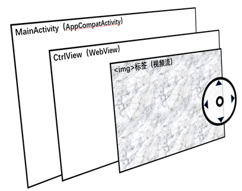
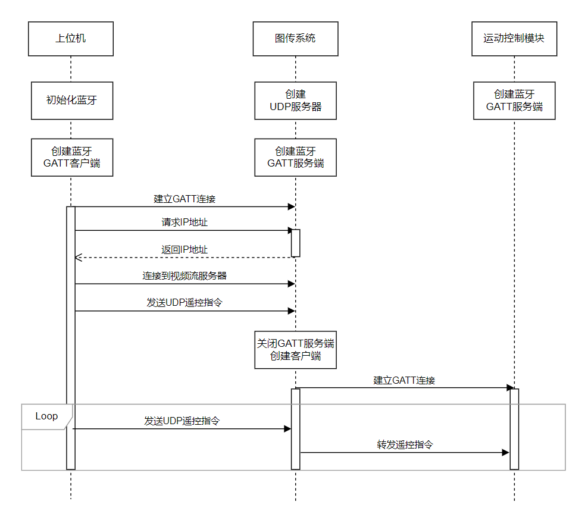
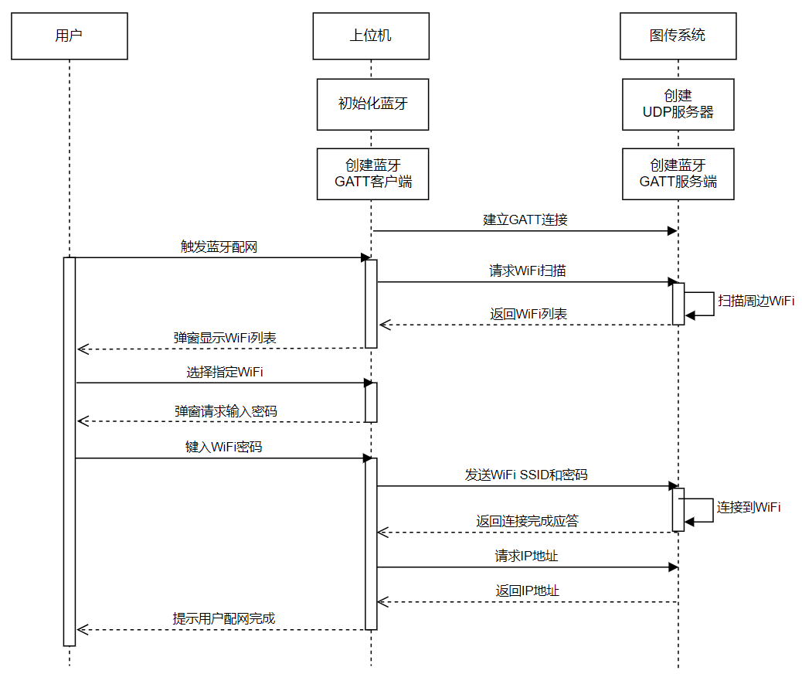

# Android App

这是本机器人项目的一个子模块，基于Android Studio开发，有以下功能：

- 读取用户触摸输入，向机器人发送遥控指令
- 拉取图传系统的视频流显示在界面上
- 配合图传系统进行蓝牙配网

---

## 实现方案

### 显示方案

由于图传系统传来的MJPG视频流可以直接在各种浏览器中访问，因此本程序直接重写了一个WebView作为主显示视图，仅需编写少量HTML+JavaScript代码即可实现视频流的显示

同时，程序重写了WebView的onDraw方法，在HTML页面上方叠加绘制了摇杆、滑块等控件，并通过onTouchEvent方法监听用户的触摸输入

### 图传连接方案

关于图传系统的通信链路，请先参阅[图传系统方案](../linux-fpv/README.md#连接方案)

为了连接到图传系统，需要通过网络建立视频流连接和UDP遥控数据链接，如下图所示时序：

> 注：图中“上位机”表示本程序，“运动控制模块”表示机器人主控模块

### 蓝牙配网方案

蓝牙配网指的是本程序先通过蓝牙直接连接到图传系统，向其发送网络信息，使其连接到指定的WiFi网络，此后即可通过网络连接到图传系统，整个过程都是自动完成的，如下图所示时序：

---

## 主要文件

- `balancebot.apk`：已编译好的安装包，可直接安装
- `app/src/main/java/com/skythinker/balancebot`：Java源代码
	- `MainActivity.java`：主Activity，负责创建各模块对象，接收事件并发送遥控指令
	- `Bluetooth.java`：蓝牙模块，负责蓝牙连接、数据收发
	- `WifiClient.java`：WiFi客户端模块，负责创建UDP客户端并收发数据
	- `CtrlView.java`：主视图，重写自WebView，负责绘制界面
- `app/src/main/AndroidManifest.xml`：Android清单文件，声明了程序的权限和Activity
- `app/src/main/res/drawable`：各图片资源
- `app/src/main/assets/streamview.html`：显示视频流的WebView页面

---

## 使用说明

1. 给机器人上电，等待图传系统启动完成(约1min)

2. 打开本程序，点击左上角的配置按钮

	- 如果不使用图传，点选“切换到蓝牙模式”，等待连接成功
	- 如果使用图传，点选“切换到图传模式”，然后再次点击配置按钮选择“进行连接配置”，按要求选择网络并输入密码，等待连接成功

3. 左上角配置按钮由灰色变亮即表示连接成功，此时即可使用摇杆控制机器人
