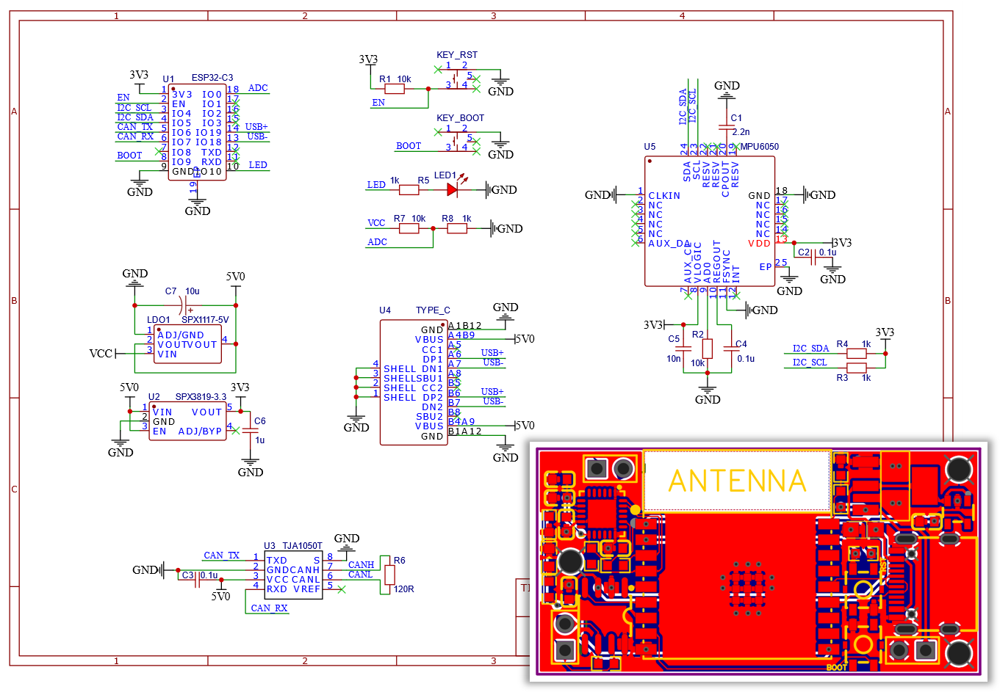

# ESP32 主控板

**简体中文 | [English](README_en.md)**

这是本机器人项目最重要的一个子模块，它的职责是：

- 读取板载陀螺仪数据
- 运行所有运动控制算法，包括平衡算法、腿长控制、roll/yaw控制等
- 通过CAN通信获取电机状态并发送扭矩指令
- 通过低功耗蓝牙接收上位机的遥控指令

---

## 硬件说明

本模块硬件方案的特性：

- 芯片方案
	- 主控芯片：ESP32-C3
	- 陀螺仪：MPU6050
	- CAN驱动芯片：TJA1050T
- 供电电压：12V，降压方案：LDO
- 调试接口：USB Type-C，直连芯片引脚，可用于烧录程序、JTAG调试和串口通信

### 文件说明

硬件相关文件都在`hardware`目录下：

- `ESP32CTRL_LCEDA_SCH.json`：立创EDA原理图文件
- `ESP32CTRL_LCEDA_PCB.json`：立创EDA PCB文件
- `ESP32CTRL_AD_SCH.schdoc`：立创EDA导出的 Altium Designer 原理图文件
- `ESP32CTRL_AD_PCB.pcbdoc`：立创EDA导出的 Altium Designer PCB文件
- `ESP32CTRL_SVG.svg`：原理图矢量图文件

> 注：将立创原理图和PCB两个json文件导入到[立创EDA标准版](https://lceda.cn/editor)中即可查看和编辑，不建议使用AD

---

## 软件说明

程序使用PlatformIO平台进行开发，使用ESP-IDF并将Arduino框架作为组件引入，因此可同时使用Arduino第三方库和ESP-IDF的底层API(如CAN通信)

为方便程序编写和调试，本程序使用ESP-IDF自带的FreeRTOS进行多任务调度，每个模块会触发一个或多个任务进行处理

### 文件说明

PlatformIO 工程位于`software`目录下，代码文件位于其中`src`目录下：

- `main.cpp`：主要程序文件，包含所有任务模块的逻辑代码
- `PID.c/h`：PID控制器的实现，包含单级和串级PID控制器
- `debug.c/h`：用于[Linkscope](https://gitee.com/skythinker/link-scope)软件实现蓝牙无线调试，不参与正常运行，读者可忽略
- 由MATLAB直接生成的C代码文件，没有可读性，读者可参阅本项目MATLAB程序说明：
	- `leg_pos.c/h`：腿部位置解算函数
	- `leg_spd.c/h`：腿部运动速度解算函数
	- `leg_conv.c/h`：腿部输出换算函数
	- `lqr_k.c/h`：LQR反馈矩阵计算函数

电机、陀螺仪、CAN通信、蓝牙、运动控制等模块的代码全部位于`main.cpp`中（~~其实是偷懒没分开~~），不同模块的函数名基本都以模块名开头，读者可以按此规律参照注释查看

---

## 使用说明

### 烧录程序

使用USB线连接到电脑，按下两个按键后先松开RESET再松开BOOT，芯片即会进入烧录模式，此时可使用PlatformIO进行烧录

### 调试程序

程序中使用Arduinod的Serial类即可从USB输出串口信息，可以使用电脑上的串口调试软件进行查看

此外，ESP32C3的USB还支持JTAG调试，连接到电脑后即可使用[OpenOCD](https://openocd.org/)等程序连接，笔者在调试过程中搭配[Linkscope](https://gitee.com/skythinker/link-scope)实现在线读写变量和曲线绘制，较为方便

### 参数标定

在`main.c`中有几个参数可能需要根据实际系统进行调整，否则将无法进行正确的解算和控制

#### 零点偏移、旋转方向参数

`Motor_InitAll`函数中分别调用`Motor_Init`进行每个电机的参数设定，包括了零点偏移`offsetAngle`和旋转方向`dir`

这两个参数用于在`Motor_Update`函数中将编码器反馈的原始角度转换为算法中的标准角度 $\phi_i$ （电机`angle`成员变量），转换公式为：

$$
\phi_i = (rawAngle_i - offsetAngle_i) * dir_i
$$

这两个参数的测量方法如下：

1. 设置`dir`参数（取值1/-1）使得电机`angle`成员变量在电机向 $\phi_i$ 正方向旋转时增加

2. 程序中设置`offsetAngle=0`（记为 $offsetAngle_i^z$ ），将电机旋转到某个角度，记录当前的计算角度为 $\phi_i^c$ ，测量当前的实际角度为 $\phi_i^r$

3. 将 $\phi_i^c$ 、 $offsetAngle_i^z$ 、 $dir_i$ 代入上方公式，求得 $rawAngle_i$ 的值

4. 将 $\phi_i^r$ 、 $rawAngle_i$ 、 $dir_i$ 代入上方公式，求得 $offsetAngle_i$ 的值，设置到程序中

5. 此时`angle`成员变量应该与实际 $\phi_i$ 一致

> 注1： $\phi_i$ 的定义可以在Matlab程序说明文档中引用的文章中找到，靠前的关节电机对应 $\phi_4$ ，靠后的关节电机对应 $\phi_1$
> 
> 注2：上方描述的均为关节电机，车轮电机仅需设置`dir`参数，使其`angle`变量正方向与算法中驱动轮力矩 $T$ 一致即可

#### 扭矩系数

> 注：若使用笔者相同电机，可以不修改该参数

与上述两个参数相同，该参数也在`Motor_InitAll`函数中进行设置，用于进行电压和扭矩的换算，公式为：

$$
voltage_i = \frac{torque_i}{torqueRatio_i}
$$

其中`torqueRatio`为扭矩系数，其测量方法如下：

1. 给电机不同的电压，测量其扭矩（笔者测的是堵转扭矩），记录为 $(v_i, \tau_i)$
2. 将 $(v_i, \tau_i)$ 拟合为线性函数 $\tau=k*v$ ， $k$ 即为`torqueRatio`的值，可以用Matlab、Excel等软件辅助计算

#### 反电动势函数

> 注：若使用笔者相同电机，可以不修改该参数

关节电机反电动势计算函数为`Motor_CalcRevVolt4010`，车轮电机为`Motor_CalcRevVolt2804`，用于根据电机的实时转速计算反电动势，输出电压指令时会根据计算结果进行补偿，以抵消反电动势

测量反电动势时，给电机不同的电压，测量其空载转速，记录为 $(v_i, \omega_i)$ ，拟合为三次幂函数 $v = f(\omega)$ ，即为反电动势函数

若反电动势标定正确，在设置电机扭矩为0时（`torque`成员为0）手动旋转电机，应该感受到阻力几乎为0（抵消反电动势时顺便抵消了大部分机械阻力）

> 注：注释掉`setup()`中的`Ctrl_Init();`，或注释所有`Motor_SetTorque`函数的调用，即可禁用控制系统的输出，此时可以自行插入代码调试电机

---

## 改进方向

- MPU6050的DMP频率只有200Hz，可以考虑更换其他芯片并编写姿态解算程序
- 硬件使用LDO进行降压，由于ESP32C3功耗较高，LDO发热量较大，可以修改为DC-DC降压
- 关键算法使用MATLAB符号化简结果直接导出，运算量非常大，几乎吃满了芯片性能，无法进一步提升控制频率，可以尝试手动化简后转为C代码
