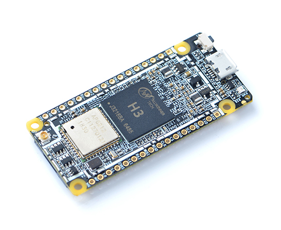
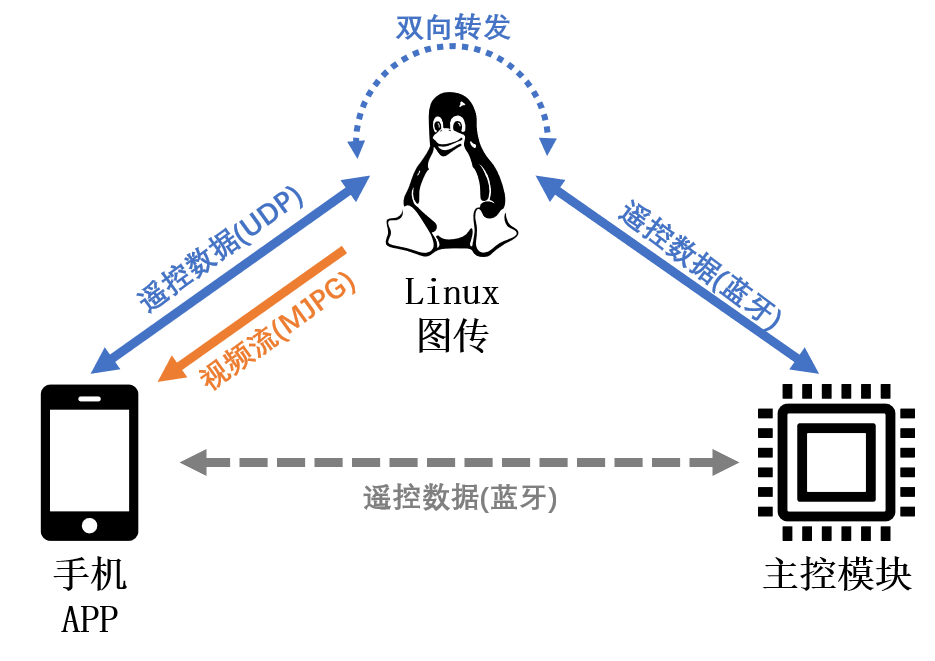

# Linux 图传系统

这是本机器人项目中的一个可选子系统，基于NanoPI Duo2开发板进行开发



这是一块 55 x 25.4mm 的非常小巧的Linux核心板，使用全志H3芯片，支持WiFi和低功耗蓝牙，引出了摄像头接口，可以运行FriendlyCore系统(基于UbuntuCore)或FriendlyWrt系统(基于OpenWrt)

本项目的图传子模块基于其FriendlyCore系统(Ubuntu 20.04)进行开发，实现了以下功能：

- 通过ffmpeg采集ov5640摄像头的视频流并压缩为mjpeg格式
- 通过ffserver将上述视频流以HTTP协议进行推流，以便在手机APP中收看
- 与手机APP配合实现蓝牙配网，在手机端操作即可连接各种网络
- 创建UDP服务端与手机APP连接，创建蓝牙GATT客户端与主控模块连接，实现遥控数据双向转发

---

## 连接方案



图传模块实现了上图所示的可拔插方案：

 - 在**不使用图传系统**的情况下，手机APP与主控模块通过蓝牙直连进行遥控数据传输(灰色箭头)
 - 在**使用图传系统**的情况下，图传系统与手机通过局域网连接，同时通过蓝牙与主控模块连接，在传输视频流(橙色箭头)的同时，将手机从局域网传来的遥控数据转发到主控模块(蓝色箭头)。此时机器人不需要在手机蓝牙范围内，仅需保证手机与图传系统在同一局域网内即可

这两种情况对于主控模块没有任何区别，因此可以在不同的场景下灵活切换，也可以完全移除图传模块

---

## 搭建方法

### 1. 安装FriendlyCore系统

1. 参照[官方文档](https://wiki.friendlyelec.com/wiki/index.php/NanoPi_Duo2/zh)进行系统固件的烧录，笔者安装的是基于Linux内核版本4.14和Ubuntu 20.04(focal)的FriendlyCore系统

2. 使用USB转串口模块将开发板连接到电脑，使用串口终端工具(如PuTTY)连接到开发板，参照官方文档登录系统并连接到WiFi网络

### 2. 安装并配置ffmpeg和ffserver

1. 下载ffmpeg和ffserver [下载地址](https://ffbinaries.com/downloads)，笔者使用的是ffmpeg v3.1.4和ffserver v3.2

2. 编写ffserver配置文件，将本仓库目录`scripts/ffserver.conf`中的内容复制到`/etc/ffserver.conf`中

3. 将`scripts/start-ffmpeg.sh`放在系统`/root/balancebot/`目录下并运行，查看是否报错，若不报错，从同一局域网下的其他设备上用浏览器访问`http://<NanoPI的IP地址>:8090/camera.mjpg`，若能看到摄像头的实时画面，则说明配置成功(记得先插上摄像头)

4. 将`scripts/mjpg-ffserver.service`复制到`/lib/systemd/system/`下，运行命令：

	```bash
	sudo systemctl daemon-reload
	```

	即可将图传指令配置为系统服务，可以通过下述命令进行启动或停止
	
	```bash
	sudo service mjpg-ffserver start
	sudo service mjpg-ffserver stop
	```

### 3. 配置Python控制脚本

1. 确定系统已经安装Python3，笔者使用的是Python 3.8.10，建议使用相近或更高版本。可以使用以下命令查看Python版本：

	```bash
	python3 --version
	```

2. 安装Python依赖库，将当前仓库目录下`python/requirements.txt`移至系统中，运行命令：

	```bash
	pip3 install -r requirements.txt
	```

3. 将仓库中`python/ctrl-proxy.py`文件复制到系统`/root/balancebot/`目录下，再将`scripts/ctrl-proxy.service`文件复制到`/lib/systemd/system/`下，运行命令：

	```bash
	sudo systemctl daemon-reload
	```

	即可将该控制脚本配置为系统服务，可以通过下述命令进行启动或停止
	
	```bash
	sudo service ctrl-proxy start
	sudo service ctrl-proxy stop
	```
4. 将Python控制服务设置为开机自启动，运行命令：

	```bash
	sudo systemctl enable ctrl-proxy
	```

此时已经完成整个图传系统的搭建

---

## 改进方向

- 经测试，本方案图传画质为640x480@25fps，直连手机热点时画面延迟约300ms，由于使用软件压缩为MJPG格式，CPU和网络带宽占用都比较高，可以尝试调用硬件编码器压缩为H264格式并传输(笔者没有成功达到预期效果)，或换用内置压缩功能的摄像头

- 不考虑图像画质的话，可以将ffmpeg+ffserver方案直接更换为[mjpg-streamer](https://github.com/jacksonliam/mjpg-streamer)方案，配置更为方便，但经测试CPU占用更高，在该分辨率下无法达到25fps帧率
