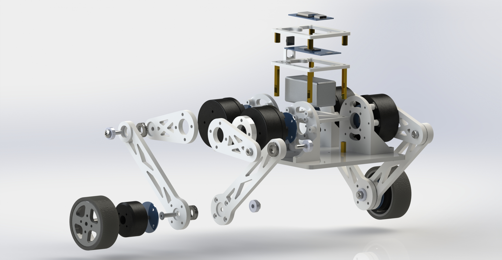
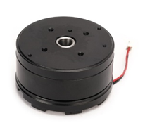
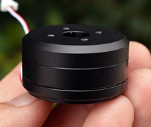
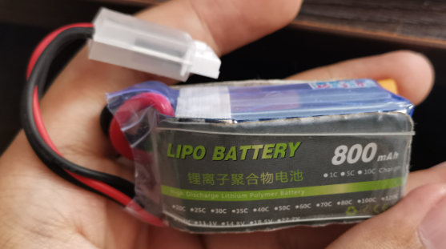
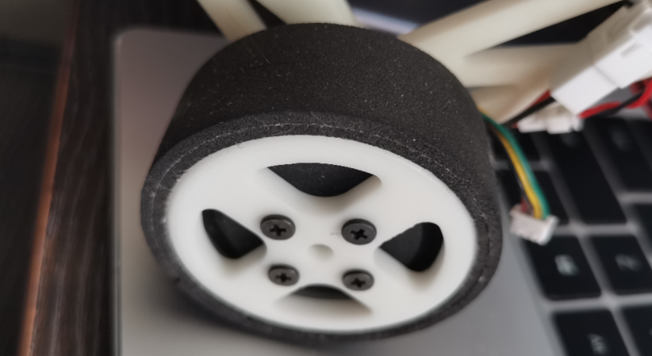

# SolidWorks 机械模型

整个机械模型使用SolidWorks 2019 SP0.0设计，当前目录包含所有零件和总装配体`总装.SLDASM`，大部分零件使用3D打印制造，底板为定制亚克力板

---

## 零件选型

> 注：下方的购买链接是笔者当时的购买渠道，仅供参考，不保证可用性

### 电机

 

关节电机使用左图所示的4010电机，车轮电机使用右图所示的2804电机，实测电机参数如下：

| 电机型号 | 额定电压 | 堵转扭矩 | 极对数 | 重量 | 购买链接 | 参考价格 |
| :-----: | :------: | :-----: | :----: | :--: | :------: | :------: |
|  4010   |  12V     | 0.22N·m |   11   | 125g | [链接](https://item.taobao.com/item.htm?spm=a1z09.2.0.0.67002e8djsrWfk&id=661262833408) | ￥50.00 |
|  2804   |  12V     | 0.04N·m |   7    |  24g | [链接](https://item.taobao.com/item.htm?spm=a21n57.1.0.0.54cb523cFK7YX5&id=688692183367) | ￥13.00 |

### 电池

电池采用了高能量密度高倍率的航模锂电池，实测参数如下：

| 电压 | 容量 | 倍率 | 重量 | 机器人续航 | 购买链接 | 参考价格 |
| :--: | :--: | :--: | :--: | :--------: | :------: | :------: |
| 3S (11.1-12.6V) | 800mAh | 25C | 57g | 20-30min | [链接](https://item.taobao.com/item.htm?spm=a1z09.2.0.0.67002e8djsrWfk&id=679306961701) | ￥28.00 | 

### 轴承

在每一个关节处都使用了一个深沟球轴承和一个推力轴承，参数如下：

| 项目 | 内径 | 外径 | 厚度 | 购买链接 | 参考价格 |
| :--: | :--: | :--: | :--: | :------: | :------: |
| 深沟球轴承 604 | 4mm | 12mm| 4mm | [链接](https://item.taobao.com/item.htm?spm=a1z09.2.0.0.67002e8djsrWfk&id=626299304028) | ￥1.30 |
| 推力轴承 F8-14M | 8mm | 14mm | 4mm | [链接](https://item.taobao.com/item.htm?spm=a1z09.2.0.0.67002e8djsrWfk&id=643067962342) | ￥2.00 |

### 螺丝

机器人上使用的大部分都是[扁平头螺丝](https://detail.tmall.com/item.htm?_u=f3m84i7t8421&id=677398679720)，有M2、M2.5、M3、M4几种规格，长度从6mm到16mm不等，有些螺丝没有在模型中画出，需要自行测量（电机上的螺纹盲孔深度为2-3mm）

### 轮胎

轮胎使用的是自粘海绵胶条，缓冲效果较好，抓地能力较强，但是耐磨性较差，需要定期更换

### 编码器磁铁

电机转子上的磁铁须使用径向充磁的磁铁，由于2804电机不自带磁铁，需要额外设计（本模型选用尺寸直径6mm x 厚度2mm） [购买链接](https://item.taobao.com/item.htm?spm=a1z09.2.0.0.67002e8dunEQwK&id=596454786426) 参考价格：￥6.00 / 5个

### 结构件

机器人底板使用的是白色定制亚克力板 [购买链接](https://detail.tmall.com/item.htm?_u=f3m84i7t207c&id=667937893428) 参考价格：￥5.00

其余全部结构件均在嘉立创使用白色树脂材料打印，全部花费约￥100.00

---

## 改进方向

- 关节电机扭矩无法完成跳跃动作，车轮电机扭矩无法越过较高障碍，可以考虑更换扭矩更大的电机
- 当前电池固定不够牢固，可以增加固定结构
- 车轮电机安装方式 ~~比较阴间~~ 不够方便，可以考虑修改
