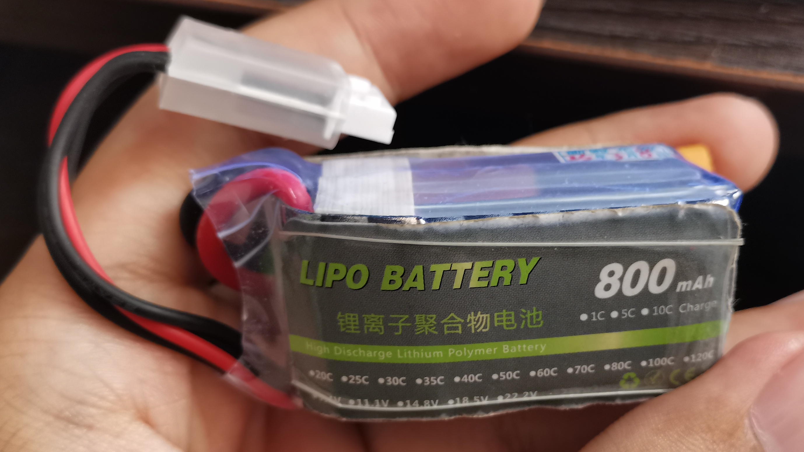

# SolidWorks 机械模型

整个机械模型使用SolidWorks 2019 SP0.0设计，当前目录包含所有零件和总装配体`总装.SLDASM`，大部分零件使用3D打印制造，底板为定制亚克力板

---

## 部分零件选型

### 电机

 

关节电机使用左图所示的4010电机，车轮电机使用右图所示的2804电机，实测电机参数如下：

| 电机型号 | 额定电压 | 堵转扭矩 | 极对数 | 重量 |
| :-----: | :------: | :-----: | :----: | :--: |
|  4010   |  12V     | 0.22N·m |   11   | 125g |
|  2804   |  12V     | 0.04N·m |   7    |  24g |

### 电池

电池采用了高能量密度高倍率的航模锂电池，实测参数如下：

| 电压 | 容量 | 倍率 | 重量 | 机器人续航 |
| :--: | :--: | :--: | :--: | :--------: |
| 3S (11.1-12.6V) | 800mAh | 25C | 57g | 20-30min |

### 轮胎

轮胎使用的是自粘海绵胶条，缓冲效果较好，抓地能力较强，但是耐磨性较差，需要定期更换

---

## 改进方向

- 关节电机扭矩无法完成跳跃动作，车轮电机扭矩无法越过较高障碍，可以考虑更换扭矩更大的电机
- 当前电池固定不够牢固，可以增加固定结构
