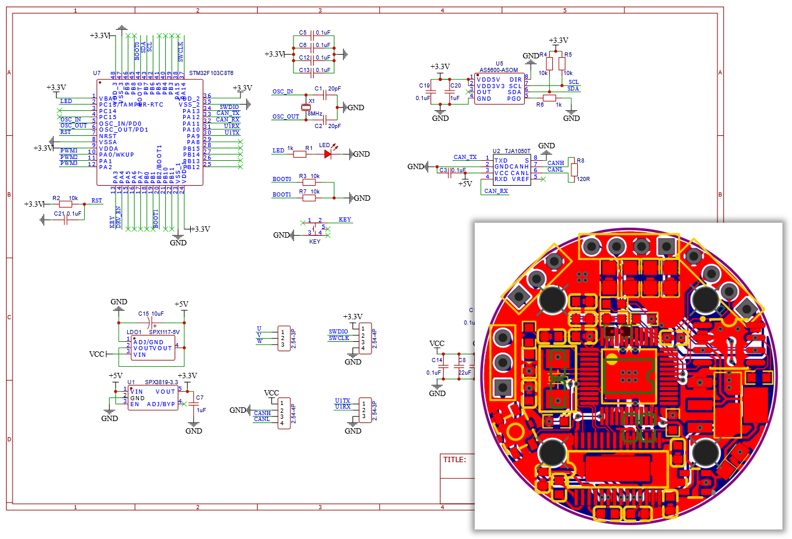

# STM32-FOC 电机驱动板

这是本机器人项目的一个子模块，基于 STM32 芯片的无刷电机驱动板，目前有如下特性：

- 芯片方案
	- 主控芯片：STM32F103C6T6
	- 驱动芯片：DRV8313
	- 磁编码器：AS5600
	- CAN驱动芯片：TJA1050T
- 仅支持电压控制扭矩，硬件不支持电流闭环
- 使用 CAN 通信控制（硬件留有串口但程序没有使用）
- 可反馈转角和转速，反馈频率500Hz
- 使用按钮设置电机ID或触发自动标定，产生的参数支持掉电保存
- PCB 尺寸：直径30mm
- 本项目中供电电压：12V
- 物料成本：约￥25

> 注：经测试 STM32F103C8T6 可直接替换，软硬件都可直接兼容

---

## 硬件说明

电路为双层板结构，使用[立创EDA](https://lceda.cn/)设计，其中的对侧打孔相距22mm，与2804电机孔位相同

### 文件说明

原理图和PCB文件均在`hardware`文件夹中：

- `STM32FOC_LCEDA_SCH.json`：立创EDA原理图文件
- `STM32FOC_LCEDA_PCB.json`：立创EDA PCB文件
- `STM32FOC_AD_SCH.schdoc`：立创导出的 Altium Designer 原理图文件
- `STM32FOC_AD_PCB.pcbdoc`：立创导出的 Altium Designer PCB文件
- `STM32FOC_SVG.svg`：原理图矢量图文件

> 注：Altium Designer 文件未经过检查，可能存在错误

---

## 软件说明

程序开发环境为 Keil uVision 5，使用 STM32CubeMX v5.6.0 生成工程，使用 HAL 库编写

FOC核心算法参考了CSDN博主 [loop222](https://blog.csdn.net/loop222) 所移植的C语言版 SimpleFOC，本程序将其移植到了HAL库中，并添加了CAN通信、Flash掉电存储、蜂鸣、按键、LED、滤波等功能

### 文件说明

`software`文件夹中为STM32代码工程，其中：

- `MDK-ARM/C6T6SimpleFoc.uvprojx`：Keil uVision 5 工程文件
- `C6T6SimpleFoc.ioc`：STM32CubeMX 工程文件
- `Src/main.c`：主要程序代码
- `Src/stm32f1xx_it.c`：各中断服务函数代码
- `USER`目录下为其他工具代码：
	- `BLDCMotor.c/h`、`FOCMotor.c/h`、`foc_utils.c`：FOC算法相关代码
	- `MagneticSensor.c/h`：AS5600磁编码器驱动代码
	- `FlashStorage.c/h`：Flash掉电存储代码

---

## 使用说明

### 硬件设置

1. 将驱动板与电机固定在一起，电机转子上的径向磁铁与磁编码器对正且相距2~3mm

2. 驱动电路板使用2.54mm排针孔引出了电机三相线、CAN总线、电源、SWD调试接口和串口，用户可根据需要自行焊接

	> 注：电源建议选择12V左右，具体范围可以参考DRV8313芯片的电压范围和降压LDO芯片的最高耐压

### 驱动ID设置及自动标定

**驱动ID**：区分一条CAN总线上多个电机的标识，范围1-8，同一总线上的驱动ID不能重复

**自动标定**：驱动需要知道电机的极对数、零点偏移量、传感器方向信息，这些信息可以通过自动标定获得

- 在正常运行状态下，LED的闪烁代表电机当前ID
- 按下按钮不松手即可进入ID设置，此时LED会以500ms周期闪烁，闪烁第N次时松手即可设置ID为N
- 闪烁次数超过8次仍不松手，LED会常亮2秒，此时松手即可进入自动标定
- 若2秒后仍然不松手，LED会熄灭，此后松手不会触发任何操作
- 自动标定时，电机会缓慢旋转，需确保电机处于空载状态，尽可能减少旋转阻力，标定成功后会播放开机音效

### CAN通信协议

CAN通信使用标准帧，波特率为1Mbps

**驱动反馈数据帧格式**：

不同ID的驱动板会使用不同的CAN数据帧标识符(StdID)发送反馈数据：

| 驱动ID | StdID | 帧类型 | DLC |
| :------: | :----------: | :----: | :-: |
| N | 0x100+N | 标准帧 | 8 |

| DATA[0-3] | DATA[4-5] | DATA[6-7] |
| :------: | :------: | :------: |
| 累计转角*1000 | 当前转速*10 | 保留 |
| 单位rad | 单位rad/s | / |
| int32_t | int16_t | / |

**驱动板接收电压指令数据帧格式**：

为节省总线带宽，不同ID的驱动板不会使用完全不同的数据帧接收数据，而是共用一个数据帧中的不同字节

共用接收数据帧 **StdID = 0x100** 的四个驱动ID为1-4：

| DATA[0-1] | DATA[2-3] | DATA[4-5] | DATA[6-7] |
| :------: | :------: | :------: | :------: |
| ID=1 输出电压 | ID=2 输出电压 | ID=3 输出电压 | ID=4 输出电压 |
| 单位mV | 单位mV | 单位mV | 单位mV |
| int16_t | int16_t | int16_t | int16_t |

共用接收数据帧 **StdID = 0x200** 的四个驱动ID为5-8：

| DATA[0-1] | DATA[2-3] | DATA[4-5] | DATA[6-7] |
| :------: | :------: | :------: | :------: |
| ID=5 输出电压 | ID=6 输出电压 | ID=7 输出电压 | ID=8 输出电压 |
| 单位mV | 单位mV | 单位mV | 单位mV |
| int16_t | int16_t | int16_t | int16_t |

也就是说，如果向总线发送StdID=0x100的数据帧，那么ID为1-4的驱动板会同时接收到指令；如果发送StdID=0x200的数据帧，则ID为5-8的驱动板会收到指令

---

## 改进方向

- AS5600磁编码器数据不够稳定，采样频率也不够高(软件IIC实测最高约2KHz)，留给滤波算法的余地不大，可以考虑更换更好的编码器
